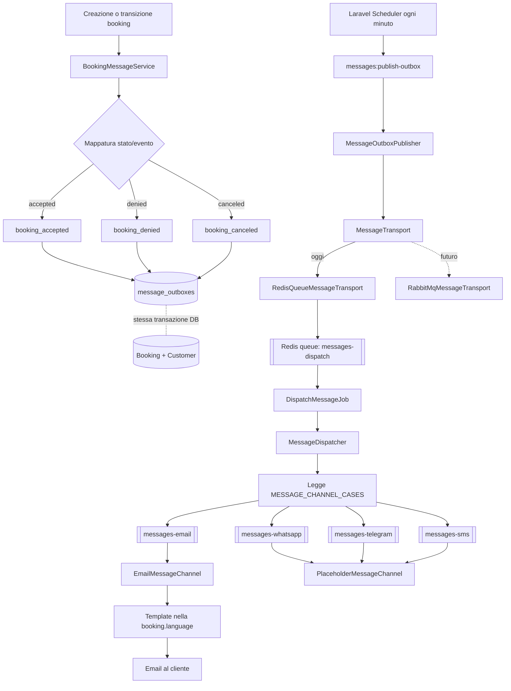

# Messaging flow

Questo documento descrive l'impianto di messaggistica asincrona del tenant e il percorso previsto verso un servizio esterno basato su RabbitMQ.

## Flusso applicativo



## Responsabilità

- `BookingMessageService`: traduce un evento o stato della prenotazione in un caso `booking_*` e crea l'outbox. Non invia messaggi.
- `message_outboxes`: conserva l'intento nello stesso commit della booking. La chiave di deduplicazione evita la registrazione ripetuta dello stesso evento logico.
- `MessageOutboxPublisher`: reclama gli eventi pendenti, li pubblica sul trasporto e gestisce retry e claim scaduti.
- `MessageTransport`: confine infrastrutturale. Riceve un `MessageEnvelope` serializzabile, non model Eloquent. Oggi usa Redis; in futuro potrà pubblicare lo stesso envelope verso RabbitMQ.
- `MessageDispatcher`: legge i canali abilitati nel tenant e crea un job indipendente sulla coda dedicata a ogni canale.
- `MessageChannel`: contratto del provider finale. Email è collegato; le code di Telegram, WhatsApp e SMS sono già isolate e i rispettivi adapter vengono collegati indipendentemente (quelli non ancora integrati restano placeholder espliciti).
- `BookingMessageContentRenderer`: risolve template e wildcard usando `booking.language`, con fallback inglese.

## Flusso passo per passo

1. Il gestore compila `/manage/bookings/create`. Il backend valida i dati della prenotazione e richiede almeno uno tra email e telefono.
2. Booking e customer vengono creati o aggiornati dentro una transazione database.
3. `BookingMessageService` traduce lo stato iniziale della booking nel relativo caso, per esempio `accepted` in `booking_accepted`.
4. Nella stessa transazione viene inserito un record `message_outboxes`. In questa fase non vengono contattati Redis né servizi esterni di consegna.
5. Il commit rende persistenti insieme booking e intento di messaggistica. Se la transazione fallisce, non rimane nessun messaggio orfano.
6. Ogni minuto lo scheduler esegue `messages:publish-outbox`.
7. `MessageOutboxPublisher` reclama gli outbox pendenti e consegna un `MessageEnvelope` al `MessageTransport` configurato.
8. Oggi `RedisQueueMessageTransport` inserisce `DispatchMessageJob` nella coda `messages-dispatch`. In futuro lo stesso envelope potrà essere pubblicato su RabbitMQ.
9. Il supervisor dispatch esegue il job. `MessageDispatcher` legge i canali abilitati per il caso e crea un `SendMessageChannelJob` per ogni canale.
10. Ogni job viene inserito nella coda specifica: `messages-email`, `messages-telegram`, `messages-whatsapp` oppure `messages-sms`.
11. Il relativo `MessageChannel` verifica che il cliente abbia il recapito necessario, risolve il template usando `booking.language` e invia tramite il provider. Per le email viene usato il mailer Laravel configurato: MailerSend in produzione e MailHog in locale.
12. Retry, backoff e fallimenti restano isolati per job: un errore email non impedisce l'elaborazione dei job Telegram, WhatsApp o SMS.

## Garanzie e comportamento operativo

La richiesta HTTP scrive soltanto sul database e non contatta Redis o provider esterni. Se Redis non è disponibile, gli eventi rimangono `pending` e saranno riprovati dallo scheduler.

Il sistema offre consegna **at least once**. Il passaggio futuro a provider reali deve usare l'id dell'outbox come chiave di idempotenza, perché un crash tra pubblicazione e aggiornamento dello stato può produrre una ripetizione.

Processi richiesti sul tenant:

```bash
php artisan schedule:work
php artisan horizon
```

Nel container tenant entrambi i processi sono gestiti da Supervisor (`laravel-worker` e `laravel-scheduler`). Se lo scheduler non è attivo, gli outbox restano intenzionalmente in stato `pending`, perché la richiesta HTTP non pubblica direttamente su Redis.

Horizon parte con tre supervisor di messaggistica. Dispatch rimane leggero e separato; email può scalare per assorbire le chiamate al servizio MailerSend (o a MailHog in locale); Telegram, WhatsApp e SMS condividono inizialmente un processo per contenere il consumo di memoria.

| Ruolo | Code | Supervisor | Processi minimi | Massimo |
| --- | --- | --- | ---: | ---: |
| Dispatch | `messages-dispatch` | `supervisor-messages-dispatch` | 1 | 1 |
| Email | `messages-email` | `supervisor-messages-email` | 1 | 3 |
| External | `messages-telegram`, `messages-whatsapp`, `messages-sms` | `supervisor-messages-external` | 1 | 1 |

Le code esterne restano separate anche se condividono il supervisor. Quando volume, latenza o rate limit di un provider richiederanno isolamento, `supervisor-messages-external` potrà essere sostituito da tre supervisor dedicati senza modificare `MessageDispatcher`, `SendMessageChannelJob` o i nomi delle code. La modifica riguarderà soltanto `config/horizon.php`.

Comando manuale utile:

```bash
php artisan messages:publish-outbox --limit=100
```

## Migrazione futura a RabbitMQ

1. Implementare `RabbitMqMessageTransport` rispettando `MessageTransport`.
2. Pubblicare `MessageEnvelope`, che contiene metadati dell'evento e uno snapshot di booking, lingua e recapiti del cliente; il consumer esterno non deve dipendere dal database tenant.
3. Impostare `MESSAGE_TRANSPORT=rabbitmq` nel tenant.
4. Sul servizio esterno rendere il consumer idempotente usando `outbox_id`.
5. Spostare gradualmente `MessageDispatcher`, renderer e channel provider sul servizio esterno senza modificare `BookingMessageService` né la transazione applicativa.


## CONF SUPERVISOR OGGI!!!

Topologia Horizon aggiornata a tre supervisor di messaggistica:
supervisor-messages-dispatch: 1 processo per messages-dispatch.
supervisor-messages-email: minimo 1 processo, scalabile fino a 3.
supervisor-messages-external: 1 processo condiviso tra Telegram, WhatsApp e SMS.

Le code esterne restano distinte:
messages-telegram
messages-whatsapp
messages-sms

Quando servirà maggiore isolamento, sarà sufficiente dividere supervisor-messages-external in tre supervisor modificando solo [horizon.php](/home/toni/Projects/ristopilot/saas-infra/ristopilot-tenant/code/config/horizon.php). Job, dispatcher, retry e nomi delle code non cambieranno.

Dopo il deploy:
php artisan horizon:terminate
per caricare la nuova topologia.


------------ ERRORI MESSAGGI
La UI inserisce la prenotazione e crea il cliente.
La tabella mysql message_outboxes ha una entry che resta fissa su status pending.

RISPOSTA
Horizon è avviato da Supervisor, ma schedule:work non lo è. Di conseguenza nessuno esegue messages:publish-outbox e il record resta correttamente pending. Inoltre c’è ancora un vecchio worker RabbitMQ attivo che tenta inutilmente 127.0.0.1:5672. Correggo Supervisor aggiungendo lo scheduler e rimuovendo quel worker legacy.

- SBLOCCA message worker publish-outbox
docker compose -f docker-compose-dev.yml exec -T ristopilot-tenant_php php artisan messages:publish-outbox --limit=100

- Vuoi consentire la verifica che Horizon stia consumando i job pubblicati verso MailHog?
docker compose -f docker-compose-dev.yml exec -T ristopilot-tenant_php php artisan horizon:status

- Vuoi ricostruire e riavviare il container PHP locale per attivare automaticamente scheduler e nuova configurazione Supervisor?
docker compose -f docker-compose-dev.yml up -d --build ristopilot-tenant_php

- Il job è già arrivato correttamente a messages-email: outbox, publisher e dispatcher funzionano. Il blocco è quindi nel consumo della coda email, molto probabilmente perché Horizon nel container non ha caricato il nuovo supervisor-messages-email oppure perché il supervisor non è partito. Controllo processi, configurazione effettiva nel container e stato delle code Redis.

docker compose -f docker-compose-dev.yml exec -T ristopilot-tenant_php sh -lc "php artisan horizon:status; php artisan horizon:supervisors; php artisan config:show messaging; php artisan config:show horizon | sed -n '/supervisor-messages-dispatch/,$p'; ps -ef | grep -E 'horizon|schedule


I supervisor sono tutti attivi e messages-email ha un worker dedicato. Quindi non è un problema di topologia: verifico ora se il job è nella lista pronta, ritardata o riservata e cerco l’eccezione associata all’outbox nei log/failed jobs.

docker compose -f docker-compose-dev.yml exec -T ristopilot-tenant_php sh -lc "php artisan queue:failed; grep -n -C 8 'a249f750-9174-479e-9ebb-a2d192d73232' storage/logs/laravel.log | tail -120; php artisan config:show mail

rg -n "^MAIL_|^APP_NAME" code/.env code/.env.example; docker compose -f docker-compose-dev.yml exec -T ristopilot-tenant_redis redis-cli LLEN queues:messages-email; docker compose -f docker-compose-dev.yml exec -T ristopilot-tenant_redis redis-cli ZCARD queues:messages-email:delayed; docker compose -f docker-compose-dev.yml exec -T ristopilot-tenant_redis redis-cli ZCARD queues:messages-email:reserved

Trovata la causa dell’assenza su MailHog: dentro il container MAIL_MAILER è impostato a log, quindi Laravel scrive le email nel log invece di consegnarle. Inoltre l’host SMTP è 127.0.0.1:2525, non il servizio Docker MailHog. Correggo l’ambiente locale a smtp://ristopilot-tenant_mailhog:1025; in produzione continuerà a essere sovrascritto con MailerSend.


Vuoi verificare direttamente tramite l'API locale di MailHog se il job email è stato consegnato?
docker compose -f docker-compose-dev.yml exec -T ristopilot-tenant_php sh -lc "sleep 3; curl -s http://ristopilot-tenant_mailhog:8025/api/v2/messages?limit=10 | php -r '\$data=json_decode(stream_get_contents(STDIN), true); echo \"MailHog messages: \".(\$data[\"total\"] ?? 0).PHP_EOL;'"

Vuoi controllare se il job email risulta ancora fisicamente nella coda Redis dopo il riavvio?
docker compose -f docker-compose-dev.yml exec -T ristopilot-tenant_php php artisan queue:monitor redis:messages-email --max=0


Vuoi consumare un singolo job email in foreground per identificare l'errore e verificare la consegna a MailHog?
docker compose -f docker-compose-dev.yml exec -T ristopilot-tenant_php php artisan queue:work redis --queue=messages-email --once --tries=1 -vvv


Vuoi ispezionare le strutture Redis della coda email per capire se i job sono pronti, riservati o ritardati?
docker compose -f docker-compose-dev.yml exec -T ristopilot-tenant_redis sh -lc "redis-cli LLEN queues:messages-email; redis-cli ZCARD queues:messages-email:reserved; redis-cli ZRANGE queues:messages-email:reserved 0 -1 WITHSCORES; redis-cli ZCARD queues:messages-email:delayed; redis-cli ZRANGE queues:messages-email:delayed 0 -1 WITHSCORES"


Vuoi completare l'ispezione Redis usando l'hostname configurato dal container?
docker compose -f docker-compose-dev.yml exec -T ristopilot-tenant_redis sh -lc "redis-cli -h ristopilot-tenant_redis LLEN queues:messages-email; redis-cli -h ristopilot-tenant_redis ZCARD queues:messages-email:reserved; redis-cli -h ristopilot-tenant_redis ZRANGE queues:messages-email:reserved 0 -1 WITHSCORES; redis-cli -h ristopilot-tenant_redis ZCARD queues:messages-email:delayed; redis-cli -h ristopilot-tenant_redis ZRANGE queues:messages-email:delayed 0 -1 WITHSCORES"

Vuoi completare l'ispezione Redis usando l'hostname configurato dal container?
docker compose -f docker-compose-dev.yml exec -T ristopilot-tenant_redis sh -lc "redis-cli -h ristopilot-tenant_redis LLEN queues:messages-email; redis-cli -h ristopilot-tenant_redis ZCARD queues:messages-email:reserved; redis-cli -h ristopilot-tenant_redis ZRANGE queues:messages-email:reserved 0 -1 WITHSCORES; redis-cli -h ristopilot-tenant_redis ZCARD queues:messages-email:delayed; redis-cli -h ristopilot-tenant_redis ZRANGE queues:messages-email:delayed 0 -1 WITHSCORES"

Vuoi confermare tramite API MailHog che il reinvio è stato ricevuto?
docker compose -f docker-compose-dev.yml exec -T ristopilot-tenant_php sh -lc "curl -s http://ristopilot-tenant_mailhog:8025/api/v2/messages?limit=10 | php -r '\$data=json_decode(stream_get_contents(STDIN), true); echo \"MailHog messages: \".(\$data[\"total\"] ?? 0).PHP_EOL;'"